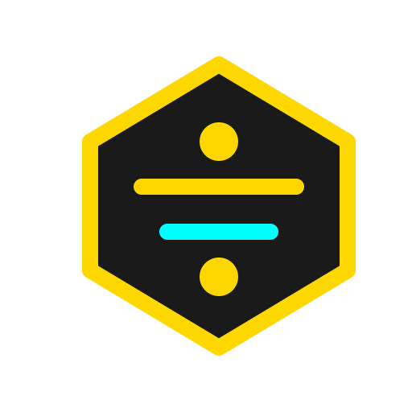

# Salako Ayoola

**CTO for Creative Teams // AI-Assisted Software Developer**

*instincts of a storyteller, bias of an engineer, powered by AI.*

---

 

## 🏗️ The Workshop

**"Itu Bobo The Builder"** is my moniker for AI-assisted software development. 
This is where I experiment. I build tools that bridge the gap between creative teams, automation, and AI.

 

### 🔓 Recently Public Repos

Where code meets creative infrastructure.

| Project | What It Is | Stack |
|---------|-----------|-------|
| **[uk-train-app](https://github.com/salakoayoola/uk-train-app)** | A modern transit interface for UK trains | TypeScript / React |
| **[say-dada](https://github.com/salakoayoola/say-dada)** | From "ta! ta!! ta!!!" to "Dada" | Node.js |
| **[tinerari](https://github.com/salakoayoola/tinerari)** | Smart itinerary planning and scheduling | TypeScript |
| **[ay-stack](https://github.com/salakoayoola/ay-stack)** | Resources and tools for AI agent experimentation | AI / TS |

 

### 🚧 In The Lab (Coming Soon)

A sneak peek at the infrastructure and creative tools currently in development behind closed doors until they're ready to ship.

- **Vynta**: Bridge between Figma and Canva workflows *(Figma Plugin API · Node.js)*
- **Plugin of Babel**: One-click subtitles in languages the big tools forgot *(After Effects CEP · Python)*
- **ahssistant**: Custom Home Assistant orchestration for the smart home
- **gigaplex-main**: A distributed experiment running across 4 Raspberry Pis
- **legacy-teleprompter-web**: Next-gen creative production tooling for iOS

---

  

*Built with curiosity. Shipped with conviction.*

